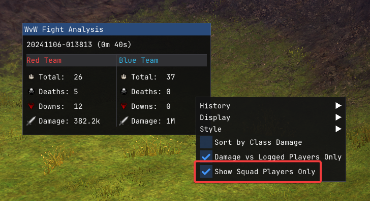
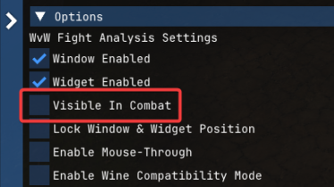

# WvW Fight Analysis Addon

## Installation
Requires the [Nexus](https://raidcore.gg/Nexus) Addon Host.
Download the latest `WvWFightAnalysis.dll` from [Releases](https://github.com/jake-greygoose/WvW-Fight-Analysis-Addon/releases) and save to `<Guild Wars 2>/addons`

## Setup
Turn on WvW logging in ArcDPS.
If you've set a custom path for your logs,
Nexus Menu > Addons > WvW Fight Anaylsis Addon > Configure > Set Custom Log Path

## Recommended Settings

To hide non squad players select 'Show Squad Players Only'

 

To hide the addons windows while in combat, so as to not see data from the previous fight, untick 'Visible In Combat'

 
